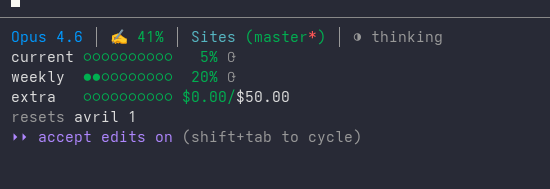

# claude-status-line

Configure your Claude Code statusline to show limits, directory and git info



## Install

Run the command below to set it up

```bash
npx @unlocker-io/claude-status-line
```

It backups your old status line if any and copies the status line script to `~/.claude/statusline.sh` and configures your Claude Code settings.

## Requirements

- [jq](https://jqlang.github.io/jq/) — for parsing JSON
- curl — for fetching rate limit data
- git — for branch info

On macOS:

```bash
sudo dnf install jq
```

## Uninstall

```bash
npx @unlocker-io/claude-status-line --uninstall
```

If you had a previous statusline, it restores it from the backup. Otherwise it removes the script and cleans up your settings.

## License

MIT
